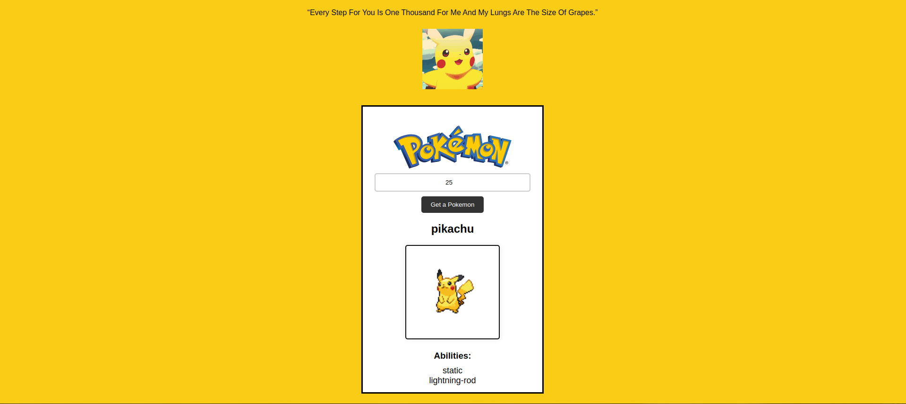

# Get Pokemon

> A simple website allows the user to get a pokemon by id (number).

## Table of contents

- [Get Pokemon](#get-pokemon)
  - [Table of contents](#table-of-contents)
  - [General info](#general-info)
  - [Screenshots](#screenshots)
  - [Technologies](#technologies)
  - [Setup](#setup)
  - [Code Examples](#code-examples)
  - [Features](#features)
  - [Status](#status)

## General info

> The objective of the project is to practice using get requests and apply separation of concerns.

## Screenshots



## Technologies

- JavaScript
- HTML5
- CSS3
- VSC code

## Setup

- clone the repo.
- `npm install`

## Code Examples

```js
const getPokemonById = async (id) => {
  try {
    const res = await fetch(`https://pokeapi.co/api/v2/pokemon/${id}`);

    if (!res.ok) {
      throw new Error(`An error has occurred: ${res.status}`);
    }

    const data = await res.json();
    return data;
  } catch (err) {
    console.error('There was an error fetching the Pokémon:', err);
    return null;
  }
};

export default getPokemonById;
```

## Features

List of features ready and Todos for future development

1. User Interface (UI)
Home Page:
A welcoming homepage with a brief introduction to the website.

Search Functionality:
An input field where users can enter a Pokémon ID (number).
A search button to submit the ID.

2. Pokémon Display Page
Pokémon Information:
Display the Pokémon's name.
Show an image of the Pokémon.
Display basic details such as abilities.

3. Error Handling
Invalid ID Handling:
Display a user-friendly error message if the entered ID is invalid or not found.

4. Backend Integration
API Integration:
Use a Pokémon API (such as PokéAPI) to fetch Pokémon details by ID.


To-do list:

Setup
Create the basic file structure (index.html, styles.css, scripts.js).

HTML
Create HTML Structure:
Set up the basic HTML document structure.
Add an input field for the Pokémon ID.
Add a search button.
Add a div for displaying Pokémon details.

CSS
Style the Website:
Style the input field, button, and Pokémon details div.
Ensure the website is responsive and looks good on different devices.

JavaScript
Fetch Pokémon Data:

Add an event listener to the search button.
Use the Fetch API to get data from PokéAPI when the button is clicked.
Handle the API response and display Pokémon details.

## Status

Project is: _Completed_
